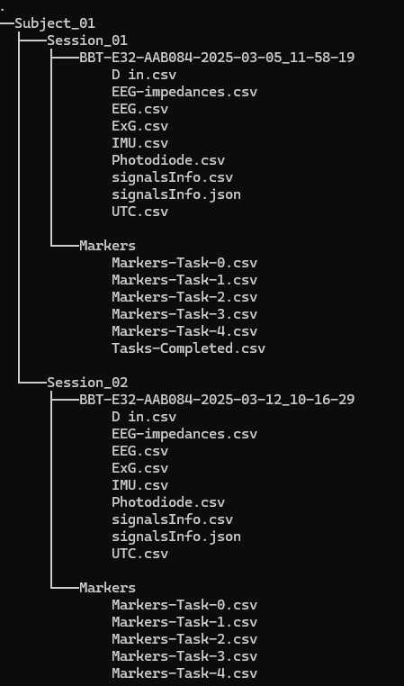
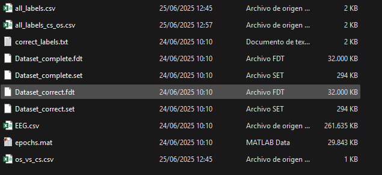

# Aim of the scripts
This folder contains a complete pipeline for EEG processing, including: Trimming, filtering, epoching and extraction of labels for each epoch for Deep Learning uses

## Use
Create a virtual environment:
``` ruby
python -m venv /path/to/new/virtual/environment
```

Install the external packages with:
```ruby
pip install -r requirements.txt
```

Execute the _batch_processing.py_ file once you have changed the lines 19 to 30 with your information.
It is mandatory the following tree-path for the RAW data folder:



The BBT-E32-* will be different for each subject and session. The code is prepared for that.
2 more folders are required outside the RAW folder. These are: The "Trimmed and translated" folder and the "Pre-processed folder".
The Tree-path the folders will obtain (they must be empty at the beginning) will be similar to the one showed above.

At the end of the execution you will have:
For one subject



And for all the subjects


In the last image we can see different label files because the execution of that part of the script was done several times for different label extraction