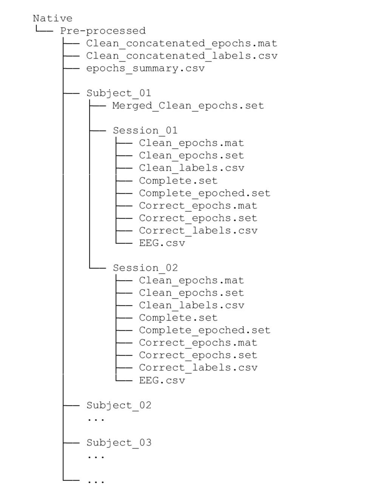

# EEG Processing Scripts

This folder contains the EEG preprocessing pipeline used in FESSCCo dataset. The scripts here implement trimming, filtering, notch/adaptive-filtering, event parsing, epoching and label extraction to prepare EEG data (BitBrain RAW) for downstream analysis and machine learning. More information can be found in the [**Official publication in Scientific Data (Nature)**](Link).

## Quick start

### Dependencies
- MATLAB (the script was developed using R2024b) with EEGLAB (version 2024.2) installed and on the MATLAB path.
- EEGLAB plugins used: ICLabel (v.1.6.), clean_rawdata (v.2.10.).
- MATLAB Signal Processing Toolbox.
- Python 3.8+ with the packages listed in `requirements.txt` (see below). The MATLAB Engine for Python is not optional and must be installed from your MATLAB distribution (not via pip).

Create a Python virtual environment and install dependencies:

```powershell
python -m venv .venv; .\.venv\Scripts\Activate; pip install -r requirements.txt
```

Notes about the MATLAB Engine for Python
- The MATLAB Engine for Python is installed from within MATLAB. See MathWorks documentation for details.

### Processing order


<br>


1. Prepare raw data folders.
<br>


<br />

2. Run `Scripts/Batch_Preprocessing.py`. Change first lines to select folders, subjects, and other parameters. You have to indicate 3 different folders:
    - RAW folder
    - Trimmed and Reformatted Folder
    - Pre-processed folder
3. Use `Scripts/Batch_epoch_selection.m` to manually remove bad epochs visually inspecting them or regarding noted down problems.
4. Run the `concatenate.py` script to generate the matrices with all the data of the dataset
5. Run the `Merge_sessions-m` script if you want to create a STUDY for Statistical Analysis



<br />

## Scripts (summary)

- `EEG_Preprocess_function.m` — MATLAB function that preprocess a session (filtering, clean_rawdata, epoching, adaptiveNotch, ICA).

- `adaptiveNotch.m` — Adaptive notch filter implementation used to remove powerline interference, harmonics and amplifier noise.

- `Batch_Preprocessing.py` — Python orchestrator for most part of the pre-processing.

- `Batch_Preprocessing.m` — Main MATLAB orchestrator for preprocessing all sessions with `EEG_Preprocess_function.m`.

- `Batch_epoch_selection.m` — MATLAB GUI-assisted epoch selection / bad-epoch removal. Opens interactive plots for the user to inspect and delete trials.

- `Merge_sessions.m` — Utility to merge multiple MATLAB EEG datasets. Eases the use of Study_creation and STUDY statistics.

- `concatenate.py` — Helper Python functions to concatenate epoch data and labels across sessions/subjects into single arrays/files for ease of use.

- `eeglab_epoch_file_generator.py` — Generates EEGLAB-compatible epoch files (.txt) from trimmed/translated data and remove repeated trials.

- `extract_labels.py` — Extracts different trial labels from stimulus grouping events with different criteria.

- `extract_steady_timestamps.py` — Finds the steady timestamp (device's timestamps) associated to a UNIX timestamp (markers' timestamps)

- `sort_tasks.py` — Small utility to sort tasks in Tasks-Completed.csv.

- `trim_real_data.py` — Another trimming/formatting utility used for real (non-simulated) sessions.

- `trim_and_translate.py` — Orchestrates the use of `extract_steady_timestamps.py` and `trim_real_data.py`.

If you need a quick one-line usage for any script, open the script and look for the header block at the top — the project convention is to include short usage notes there. More information can be found in the [**Official publication in Scientific Data (Nature)**](Link).
