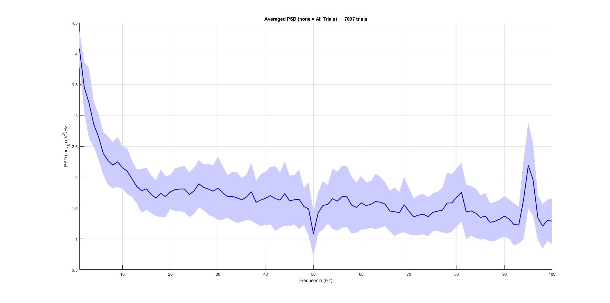
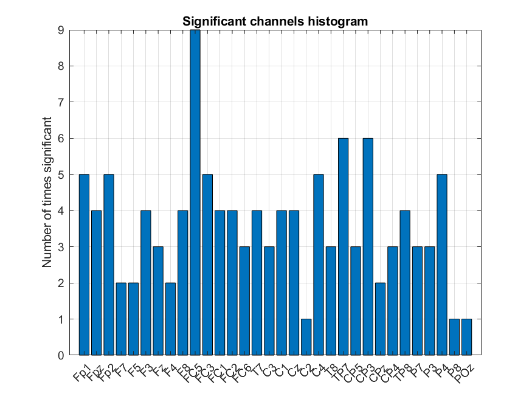
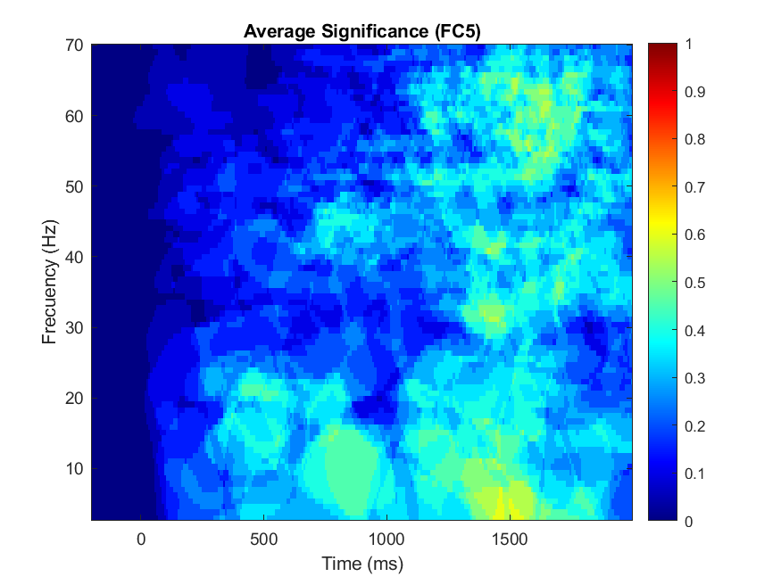

# EEG Statistical Analysis

This folder contains scripts to compute group-level summaries and statistical tests
from preprocessed EEG epochs produced by the pipeline (EEGLAB datasets or concatenated
MAT files + CSV). The tools here support study creation, averaged ERPs/PSDs, and
time–frequency significance testing (per-subject permutation tests + group summaries).

---

## Quick overview

Typical workflow:

1. Prepare preprocessed session outputs using the [EEG Processing scripts](./../EEG_Processing/):
   - Per-session: `Clean_epochs.set` or `Merged_Clean_epochs.set`
   - Project-level concatenation: `Clean_concatenated_epochs.mat` and `Clean_concatenated_labels.csv`
2. Build an EEGLAB STUDY: run `Create_Study.m`. Note some information is Hard-coded for FESSCCo dataset.
3. Compute PSDs and statistics and summaries:
   - `Average_PSDs.m` — averaged power spectral density plots per group. "None" group will average for all the trials.
   - `TFSignificance.m` — per-channel time–frequency 1-WAY ANOVA permutation tests and mean TF significance
   - `SignificantChannels.m` — per-subject ERP  1-WAY ANOVA permutation tests statistics to find frequently significant electrodes
4. Quick label/epoch summaries (Python): `label_count.py`.

---

## Files in this folder

- `Create_Study.m`  
  Build an EEGLAB `STUDY` from per-subject merged `.set` files, define STUDY designs,
  and precompute ERP/PSD/ERSP/ITC.

- `Average_PSDs.m`  
  Compute Welch PSDs from averaged epochs per group and save per-group PSD figures.
  Edit FFT/Welch parameters near the top (window, overlap, fmin/fmax).

  


- `SignificantChannels.m`  
  Run std_erpplot-based per-subject statistics and collect which electrodes are
  most often significant. Produces per-subject topoplots, a recurrence histogram,
  and several summary PNGs.

   

- `TFSignificance.m`  
  Run per-subject TF 1-WAY ANOVA permutation tests (FieldTrip mode) for a selected channel and design (typically the ones that appeared as most significant in [SignificantChannels.m](./SignificantChannels.m)).
  Collect binary TF masks across subjects and produce averaged TF significance maps, where 1 means significant for all the subjects and 0 means not significant for any subject.

  


- `label_count.py`  
  Quick Python EDA that reads `epochs_summary.csv` and produces summary CSV + plots:
  - epochs progression in the different states of pre-processing
  - final epochs percentage per session
  - OS vs CS label counts and per-subject label distribution


---

## Required inputs (what scripts expect)

- `Create_Study.m`
    - Merged sessions EEGLAB `.set` files (e.g., `Merged_Clean_epochs.set`)
- `Average_ERP.m` and `Average_PSD.m`: Concatenated files.
    - `Clean_concatenated_epochs.mat` — variable `epochs` (Trials × Samples × Channels)
    - `Clean_concatenated_labels.csv` — metadata rows matching `epochs`
    - Channel locations file for topoplot (e.g., `BitBrain_SSI_placement.loc`) referenced in scripts
- `label_count.py`  
    - `epochs_summary.csv` with all the progress across the pre-processing stages
---

## Dependencies

- MATLAB (the code was developed using version R2024b)
- EEGLAB (the code was developed using version 2024.2) with Fieldtrip Plugin
- MATLAB Signal Processing Toolbox
- Python (the code was developed using version 3.10):
  - pandas
  - matplotlib

---


## Outputs & folder structure

Scripts save PNGs, `.mat` and `.csv` summaries under configured `out_path` / `output_dir` variables. Typical output tree:

```
Outputs/
├─ ERPs/
│   ├─ Signals/
│   │   └─ Average_ERP_<grouping>_<group>.png
│   │   └─ ...
│   └─ Topo/
│   │   └─ Topo_<grouping>_<group>.png
│   │   └─ ...
├─ PSDs/
│   ├─ Signals
│   │   └─ Average_PSD_<grouping>_<group>.png
├─ Significant_TFMaps/
│   ├─ <Study_Design>/
│   │   ├─ <Electrode>/
|   │   │   ├─ <Time_Region>/
|   |   │   │   ├─ ERSP_TFmap_Subject_<subjectID>_Ch_<electrode>
|   |   │   │   ├─ ...
|   |   │   │   ├─ significances.mat
|   |   |   │   └─ mean_significance_electrode.png
|   |   |   └─ ...
|   |   └─ ...
|   └─ ...
└─ Significant_Channels/
   ├─ <Study_Design>/
   │   ├─ <Time_Region>/
   │   │   ├─ ERP_Topoplot_Subject_<subjectID>
   │   │   ├─ ...
   │   │   ├─ pcond_summary.mat
   │   │   ├─ pcond_summary.csv
   │   │   ├─ Topoplot_Significant_Recurrence.png
   │   │   ├─ Topoplot_Interpolated_Significance.png
   │   │   ├─ Topoplot_Global_Mean_Exact_Significance.png
   |   │   └─ Histogram_Significant_Channels.png
   |   └─ ...
   └─ ...


```

---

## Tips

- Ensure epochs and metadata labels are aligned. 
- FieldTrip/cluster TF tests are compute-intensive — run overnight or on a machine with sufficient RAM/CPU.

---